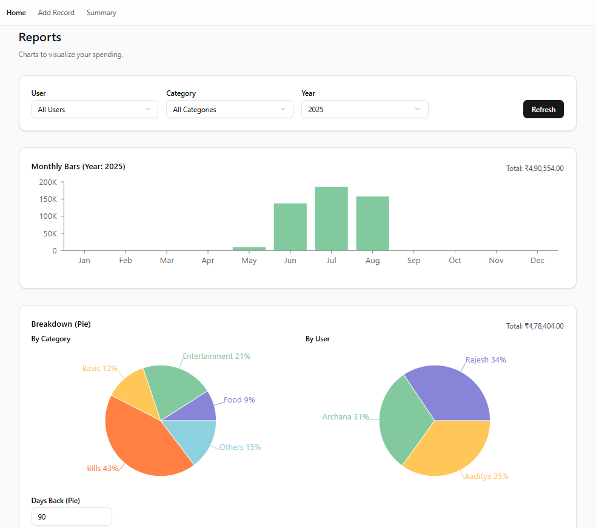
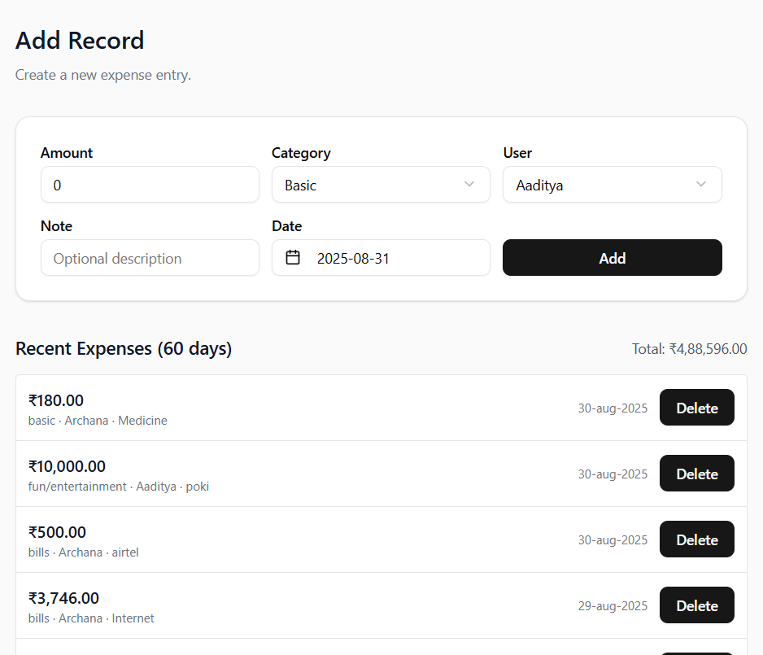
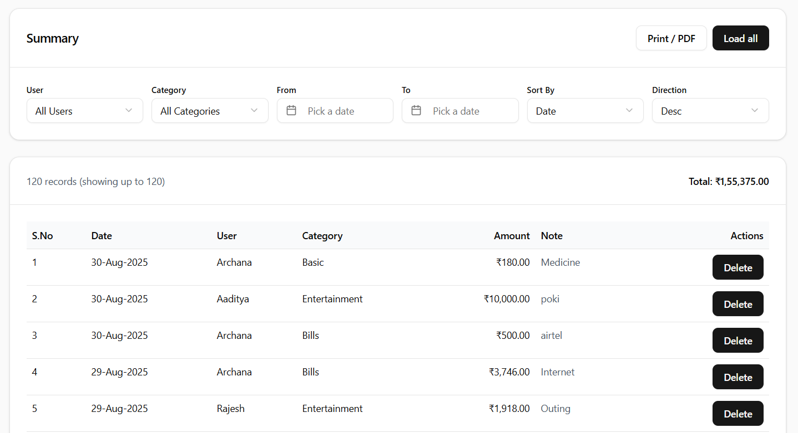
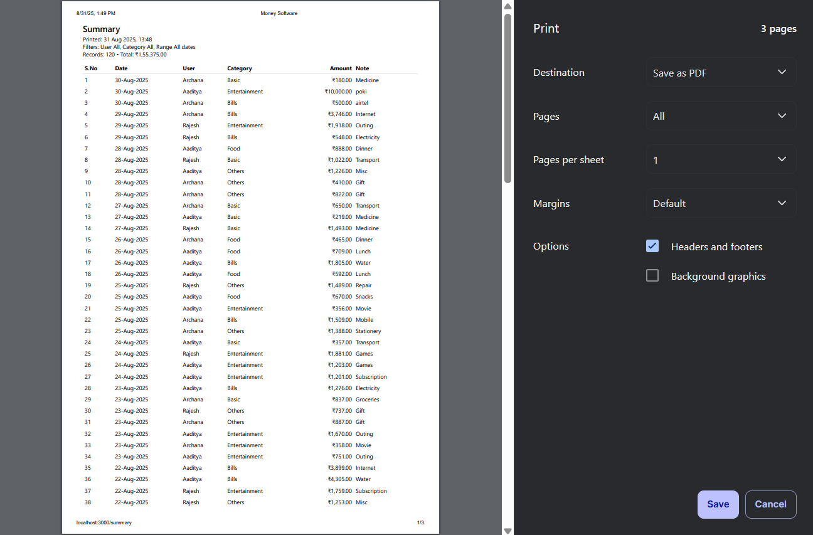

# 💰 Money Software

<div align="center">
  
*A modern, intuitive expense tracking and financial management application*

[](https://nextjs.org/)
[](https://reactjs.org/)
[](https://mongodb.com/)
[](https://tailwindcss.com/)

</div>

---

## 📸 Screenshots

<div align="center">

### Dashboard Overview


### Add Records


### Summary



### Print Preview


</div>

## ✨ Features

- 📊 **Interactive Dashboard** - Beautiful charts and visualizations powered by Recharts
- 💳 **Expense Tracking** - Add, edit, and categorize your expenses with ease
- 📈 **Financial Analytics** - Comprehensive reports and insights into your spending patterns
- 🗓️ **Date-based Filtering** - Track expenses by date ranges and time periods
- 💱 **Currency Support** - Native support for Indian Rupee (INR) formatting
- 📱 **Responsive Design** - Seamless experience across desktop and mobile devices
- 🎨 **Modern UI** - Clean, intuitive interface built with shadcn/ui components
- 🔍 **Smart Search** - Quickly find expenses with advanced filtering options
- 📊 **Time Series Analysis** - Track spending trends over time
- 💾 **Automatic Saving** - Real-time data persistence with MongoDB

## 🛠️ Tech Stack

<div align="center">

| Frontend | Backend | Database | Styling | Tools |
|----------|---------|----------|---------|-------|
|  |  |  |  |  |
|  |  |  |  |  |

</div>

## 🚀 Installation

### Prerequisites

- Node.js 18+ installed on your machine
- MongoDB database (local or cloud)
- Git for version control

### Quick Start

1. **Clone the repository**
   ```bash
   git clone https://github.com/sahay-aaditya-raj/money-software.git
   cd money-software
   ```

2. **Install dependencies**
   ```bash
   npm install
   ```

3. **Set up environment variables**
   ```bash
   cp .env.example .env.local
   ```
   
   Update the `.env.local` file with your MongoDB connection string:
   ```env
   MONGODB_URI=your_mongodb_connection_string
   ```

4. **Seed the database (optional)**
   ```bash
   npm run seed
   ```

5. **Start the development server**
   ```bash
   npm run dev
   ```

6. **Open your browser**
   
   Navigate to [http://localhost:3000](http://localhost:3000) to see the application in action!

## 📖 Usage

### Adding Expenses


1. Navigate to the "Add Expense" page
2. Fill in the expense details (amount, category, description, date)
3. Click "Save" to record your expense

### Viewing Reports


- **Summary View**: Get a quick overview of your spending
- **Time Series**: Analyze spending patterns over time
- **Category Breakdown**: See which categories consume most of your budget
- **Range Analysis**: Compare spending across different time periods

## 🔧 API Documentation

### Endpoints

| Method | Endpoint | Description |
|--------|----------|-------------|
| `GET` | `/api/expenses` | Retrieve all expenses |
| `POST` | `/api/expenses` | Create a new expense |
| `GET` | `/api/summary` | Get expense summary |
| `GET` | `/api/reports/time-series` | Get time series data |
| `GET` | `/api/reports/range-breakdown` | Get range breakdown |
| `GET` | `/api/reports/available-years` | Get available years |

### Example API Usage

```javascript
// Adding a new expense
const response = await fetch('/api/expenses', {
  method: 'POST',
  headers: {
    'Content-Type': 'application/json',
  },
  body: JSON.stringify({
    amount: 500,
    category: 'Food',
    description: 'Lunch at restaurant',
    date: '2025-08-31'
  })
});
```

## 🎨 Customization

### Styling

The application uses Tailwind CSS for styling. You can customize the theme by modifying:

- `tailwind.config.js` - Main configuration
- `app/globals.css` - Global styles
- `components/ui/` - Individual component styles

### 🏷️ Managing Categories and Users

The application uses a centralized data management system for categories and users. All data is managed through the `lib/data.js` file.

#### Adding New Categories

To add new expense categories:

1. Open `lib/data.js`
2. Add your new category to the `CATEGORIES` array:
   ```javascript
   export const CATEGORIES = [
     { value: "basic", label: "Basic" },
     { value: "bills", label: "Bills" },
     { value: "food", label: "Food" },
     { value: "travel", label: "Travel" }, // ← Add new category here
     // ... other categories
   ];
   ```
3. Restart your development server
4. The new category will automatically appear in all dropdowns

#### Adding New Users

To add new users to the system:

1. Open `lib/data.js`
2. Add your new user to the `USERS` array:
   ```javascript
   export const USERS = [
     { value: "aaditya", label: "Aaditya" },
     { value: "archana", label: "Archana" },
     { value: "rajesh", label: "Rajesh" },
     { value: "newuser", label: "New User" }, // ← Add new user here
     // ... other users
   ];
   ```
3. Restart your development server
4. The new user will automatically appear in all user selection dropdowns

#### Data Structure

Each category and user object has:
- `value`: Used for database storage and internal logic
- `label`: Displayed in the user interface

The system also provides utility functions:
- `getCategoryLabel(value)` - Get display label for a category
- `getUserLabel(value)` - Get display label for a user
- `isValidCategory(value)` - Check if a category is valid
- `isValidUser(value)` - Check if a user is valid

## 📊 Project Structure

```
money-software/
├── 📁 app/                  # Next.js app directory
│   ├── 📄 page.js           # Main dashboard
│   ├── 📄 layout.js         # Root layout
│   ├── 📁 add/              # Add expense page
│   ├── 📁 api/              # API routes
│   │   ├── 📁 expenses/     # Expense endpoints
│   │   ├── 📁 reports/      # Report endpoints
│   │   └── 📁 summary/      # Summary endpoints
│   └── 📁 summary/          # Summary page
├── 📁 components/           # Reusable components
│   └── 📁 ui/               # UI components
├── 📁 lib/                  # Utility functions
│   ├── 📄 data.js           # ⭐ Centralized categories and users configuration
│   ├── 📄 db.js             # Database connection utilities
│   ├── 📄 format.js         # Data formatting functions
│   └── 📄 utils.js          # General utility functions
├── 📁 models/               # Database models
├── 📁 public/               # Static assets
└── 📁 scripts/              # Build scripts
```

## 🤝 Contributing

Contributions are welcome! Please feel free to submit a Pull Request. For major changes, please open an issue first to discuss what you would like to change.

### Development Workflow

1. Fork the repository
2. Create your feature branch (`git checkout -b feature/AmazingFeature`)
3. Commit your changes (`git commit -m 'Add some AmazingFeature'`)
4. Push to the branch (`git push origin feature/AmazingFeature`)
5. Open a Pull Request

### Code Quality

- Run `npm run lint` to check code quality
- Run `npm run format` to format code
- Ensure all tests pass before submitting

## 📄 License

This project is licensed under the MIT License - see the [LICENSE](LICENSE) file for details.

## 👨‍💻 Author

**Aaditya Raj**
- GitHub: [@sahay-aaditya-raj](https://github.com/sahay-aaditya-raj)
- LinkedIn: [Connect with me](https://linkedin.com/in/aaditya-raj-sahay)

## 🙏 Acknowledgments

- Built with [Next.js](https://nextjs.org/) - The React Framework for Production
- UI Components from [shadcn/ui](https://ui.shadcn.com/)
- Charts powered by [Recharts](https://recharts.org/)
- Icons from [Lucide React](https://lucide.dev/)
- Database powered by [MongoDB](https://www.mongodb.com/)

---

<div align="center">

**⭐ Star this repository if you find it helpful!**

Made with ❤️ and ☕ by [Aaditya Raj](https://github.com/sahay-aaditya-raj)

</div>
